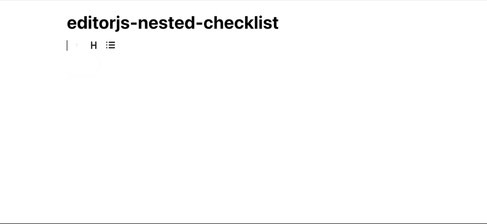

# Nested Check List Tool for Editor.js

Multi-leveled lists for the [Editor.js](https://editorjs.io).

Use `Tab` and `Shift+Tab` keys to create or remove sublist with a padding.



## Installation

### Install via NPM

    npm i @calumk/editorjs-codeflask

```javascript
import NestedCheckList from '@calumk/editorjs-nested-checklist';
```

## Usage

Add the NestedList Tool to the `tools` property of the Editor.js initial config.

```javascript
import EditorJS from '@editorjs/editorjs';
import NestedList from '@editorjs/nested-list';

var editor = EditorJS({
  // ...
  tools: {
    ...
    nestedChecklist: {
      class: NestedCheckList,
    },
  },
});
```

## Config Params
This Tool has no config params

## Tool's settings

You can choose list`s type.

| Style     | Description                |
| --------- | -------------------------- |
| none      | No style, indentation only |
| Ordered   | Numbered                   |
| Unordered | Bullets                    |


## Output data

| Field | Type     | Description                                        |
| ----- | -------- | -------------------------------------------------- |
| style | `string` | type of a list: `ordered` or `unordered` or `none` |
| items | `Item[]` | the array of list's items                          |

Object `Item`:

| Field   | Type     | Description               |
| ------- | -------- | ------------------------- |
| content | `string` | item's string content     |
| items   | `Item[]` | the array of list's items |


```json
{
    "type" : "list",
    "data" : {
        "style" : "unordered",
        "items" : [
            {
              "content": "Apples",
              "checked": null,
              "items": [
                {
                  "content": "Red",
                  "checked" : true,
                  "items": []
                },
                {
                  "content": "Green",
                  "checked" : false,
                  "items": []
                },
              ]
            },
            {
              "content": "Bananas",
              "items": [
                {
                  "content": "Yellow",
                  "checked" : true,
                  "items": []
                },
              ]
            },
        ]
    }
},
```
